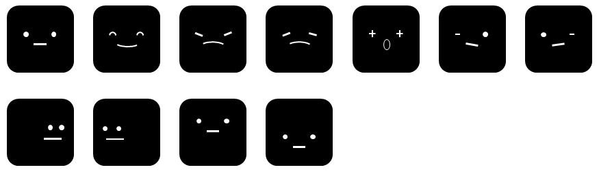

# stackchan-uiflow2
## このリポジトリについて
このリポジトリは、[アールティ版スタックチャン](https://rt-net.jp/products/rt-stackchan/)(Stach-chan)の機能をUIFlow2に実装したものです。

UIFlow2は、M5Stackが公式にサポートしている GUIベースのプログラミング環境です。
内部の実装は、カスタム化されたMicroPythonになっており、GUIなしでもプログラム開発を行うことができます。

## 機能
実装した機能は以下の通りです。

+ **顔のレンダリング**
    * 通常（瞬きあり）、笑い、怒り、悲しみ、ウィンク（左、右）、顔の向き（左右上下）、その他カスタマイズ可能
    
    

+ **モータ制御**
    * Dynamixel または SG90
+ **音声合成**
    * Google Text-to-speech, Voicevox(準備中)
+ **音声合成**
    * Google Speech-to-text, Vosk(独自サーバー、準備中)
+ **Webサーバ**
    * 独自実装、REST API追加可能
+ **カメラ操作**
    * Webサーバを介した画像取得

## Quick Start
### ファームウェアのインストール
ファームウェアは、公式サイトから提供されているUIFlow2のファームウェアをインストールしてください。

- [CoreS3のファームウェアインストール](https://docs.m5stack.com/ja/uiflow2/m5cores3/program)

### プログラムと設定ファイル等のアップロード
#### プログラムのアップロード
リポジトリの scripts/ 以下にあるPythonのプログラム（main.pyを除く）を /flash/libs の下にアップロードします。

scripts/main.pyを /flashの下にアップロードします。

#### 設定ファイルのカスタマイズとアップロード
設定ファイルとして以下の3つが必要です。conf/の下にデフォルトの設定ファイルがありますので、お使いの環境にあわせて修正してください。

- stackchan.json
- wlan.json
- apikey.txt

###### stackchan.json
スタックチャンのモータと音声認識、音声合成のサーバの設定を行います。
conf/stackchan.jsonには、RT版スタックチャンのための設定を記載しています。

- **motor**: "Dynamixel" または "SG90"
- **tts**: "google" または "voicevox"
- **asr**: "google"　または "vosk"
- **dialog**: "gemini"　または "openai"

音声合成と音声認識にGoogleCloudを使わない場合には、それぞれのサーバが動作しているIPアドレスの設定が必要です。

###### wlan.json
このファイルでは、WirelessLANの接続設定を行います。
Home, Work, Mobileの3つの設定を行ってください。
プログラムの起動時に、アクセスポイントをスキャンし自動接続を行います。

```
{
    "Home": {"essid": "", "passwd": ""},
    "Work": {"essid": "", "passwd": ""},
    "Mobile": {"essid": "", "passwd": ""}
}
```
###### apikey.txt
このファイルは、GoogleCloudサービスへアクセスするためのAPIキーを設定します。
音声認識および音声合成のAPIキーは、*OPENHRI_KEY*へ記載し、GeminiへアクセスするためのAPIキーは、*GEMINI_KEY*に記載してください。
このパッケージでは、まだ、Geminiの動作検証を終えていませんが、後日、機能追加予定です。

```
OPENHRI_KEY=
GEMINI_KEY=
OPENAI_KEY=
```

##### 設定ファイルのアップロード
stackchan.json, wlan.json, apikey.txtの3つの設定ファイルを SDカード（/sd） にアップロードしてください。

#### HTMLファイルのアップロード
このパッケージでは、Webサーバを起動します。
WebブラウザからStack-chanのIPアドレスへアクセスすると、SDカードの /sd/htmlの下にあるHTMLファイルを送信します。
サンプルとして、index.htmlとtts_sample.html, favison.ico及び js/joy.min.js がありますので、　*/sd/html* の下にコピーしてください。


以上で必要なファイルのアップロードは完了です。
